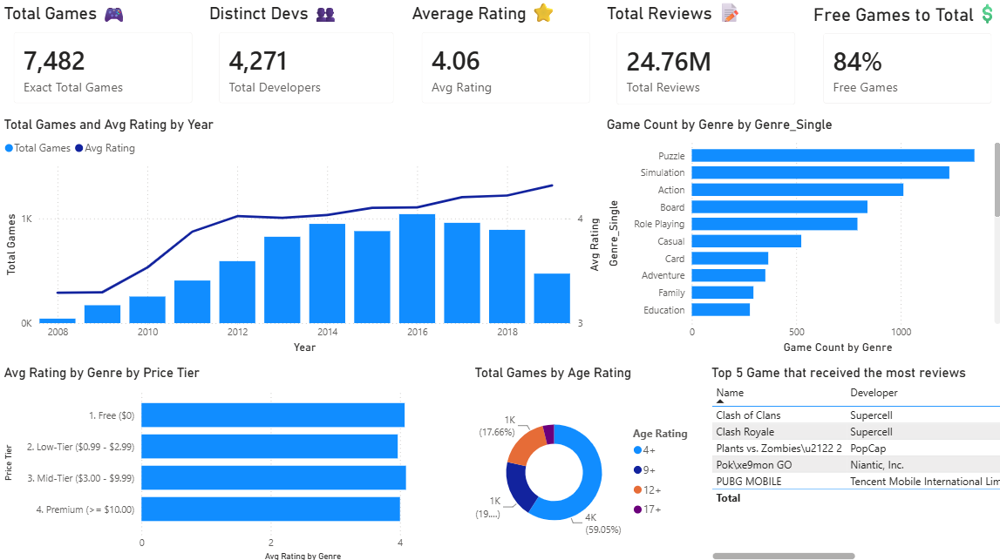
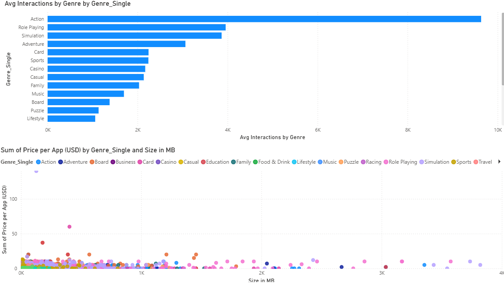
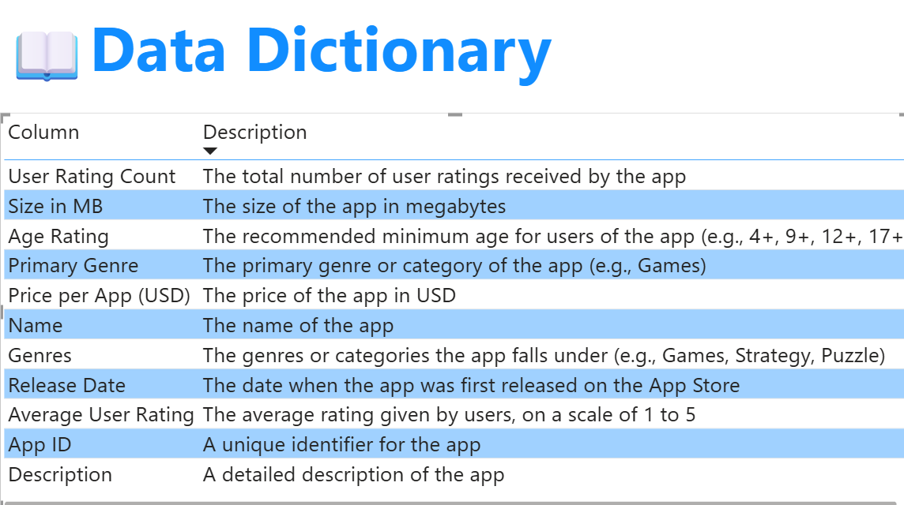

# App-Store-Game-Analysis
An End-to-End Data Analysis project exploring App Store Mobile Games (2008-2019). Uncovering pricing strategies and market insights using Python, PostgreSQL, and Power BI.
A data analysis project analyzing the App Store Mobile Game market (2008 - 2019). The goal is to identify market trends, understand player engagement patterns, and optimize product and pricing strategies for game developers and publishers.

### 📊 Khám phá Dữ liệu & Business Insights (Power BI)

Dựa trên tập dữ liệu gồm hơn 7.4K tựa game mobile từ hơn 4.2K nhà phát triển, tôi đã xây dựng hệ thống Dashboard tương tác để phân tích bức tranh toàn cảnh của thị trường. Điểm đánh giá (Rating) trung bình toàn sàn đang ở mức khá tốt (4.06/5.0), với mô hình Free-to-play thống trị (84% là game miễn phí).

Dưới đây là những phát hiện quan trọng nhất (Key Insights) để giúp các Studio/Nhà phát triển tối ưu hóa chiến lược:

**1. Nghịch lý Thể loại (The Genre Paradox)**
* **Mức độ cạnh tranh:** Thể loại Giải đố (**Puzzle**) và Mô phỏng (**Simulation**) đang có số lượng game áp đảo nhất trên sàn (Puzzle vượt mốc 1.200 tựa game).
* **Mức độ tương tác:** Tuy nhiên, Hành động (**Action**) mới là thể loại thống trị tuyệt đối về lượng tương tác trung bình (tiệm cận 10.000 lượt đánh giá/game), cao gấp đôi Role Playing ở vị trí thứ 2 và vượt xa Puzzle. Điều này cho thấy Puzzle là "đại dương đỏ" rủi ro: cực đông đối thủ cạnh tranh nhưng sự chú ý của người chơi trên mỗi game lại rất thấp.

**2. Xu hướng Chất lượng & Giá trị phân khúc (Quality & Tiers)**

* **Chất lượng tăng dần theo thời gian:** Dù số lượng game phát hành mới có dấu hiệu chững lại và giảm nhẹ từ sau năm 2016, nhưng điểm Rating trung bình lại có xu hướng **tăng đều đặn và liên tục** (chạm mốc ~4.5 vào năm 2019). Thị trường đang dịch chuyển rõ rệt từ "lượng" sang "chất".
* **Định giá vs Đánh giá:** Các tựa game ở phân khúc trả phí (Low-Tier, Mid-Tier, Premium) đều giữ được mức Rating trung bình rất ổn định (trên 4.0), không hề thua kém nhóm game Free. Biểu đồ phân tán (Scatter plot) cho thấy các game dung lượng cao thuộc nhóm RPG/Adventure hoàn toàn có thể bán với giá cao (Premium) nhưng vẫn được thị trường đón nhận.

**3. Chân dung Thị trường & Những kẻ dẫn đầu (Market Leaders)**
* Mặc dù phân khúc **4+** (phù hợp cho mọi lứa tuổi) chiếm thị phần lớn nhất (59.05%), nhưng các "tượng đài" lọt Top 5 lượt đánh giá khủng nhất toàn sàn (Clash of Clans, PUBG MOBILE, Pokémon GO) lại chủ yếu thiên về các thể loại đòi hỏi tính chiến thuật, hành động và tương tác nhiều người chơi (Multiplayer).

### 💡 Đề xuất Giải pháp Kinh doanh (Actionable Recommendations) cho Developers

Dựa trên các insight từ dữ liệu, để tối ưu hóa lợi nhuận và tăng khả năng sống sót trên Store, các Nhà phát triển/Studio game có thể áp dụng các chiến lược sau:

* **Tránh "bẫy" Puzzle, tập trung vào Action/RPG hoặc Thị trường ngách:** Hạn chế đầu tư làm game Puzzle thuần túy trừ khi có cơ chế gameplay cực kỳ đột phá. Thay vào đó, hãy nhắm vào các thể loại mang lại mức độ gắn kết sâu như **Action** hoặc **Role Playing** để dễ dàng xây dựng cộng đồng trung thành. Nếu nguồn lực có hạn, có thể chọn các ngách ít cạnh tranh hơn nhưng tương tác ổn định (như Board, Adventure).
* **Tự tin áp dụng chiến lược Trả phí (Premium/Paid) cho game chất lượng:** Dữ liệu chứng minh người chơi sẵn sàng trả tiền và để lại đánh giá tốt nếu game xứng đáng. Thay vì chen chân vào "biển máu" 84% game Free, hãy cân nhắc sử dụng chiến lược định giá **Mid-tier ($3.00 - $9.99)** đối với các tựa game có đồ họa nặng (Size lớn) và cốt truyện sâu sắc để lọc tệp người chơi chất lượng và thu hồi vốn nhanh hơn.
* **Dịch chuyển tệp khách hàng mục tiêu sang nhóm tuổi 9+ và 12+:** Phân khúc 4+ đang quá chật chội (gần 60%). Việc gia tăng chiều sâu, cơ chế chiến đấu hoặc tính cạnh tranh để đẩy nhãn độ tuổi lên **9+** hoặc **12+** sẽ giúp game dễ dàng tiếp cận nhóm game thủ thực thụ (Hardcore/Midcore gamers) – những người có khả năng chi trả (In-App Purchases) mạnh tay hơn rất nhiều so với tệp trẻ em.

---
### 📚 Data Dictionary

